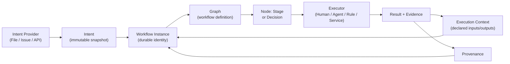
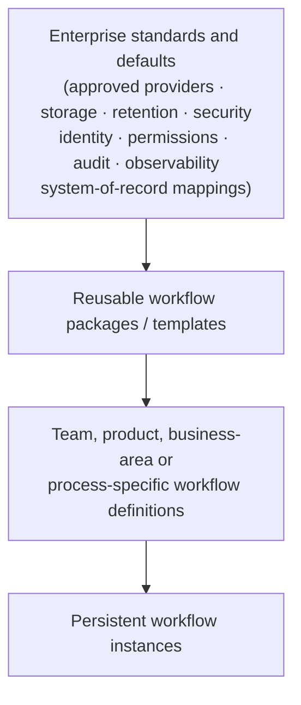
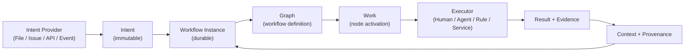
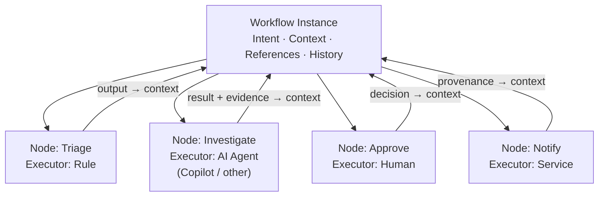
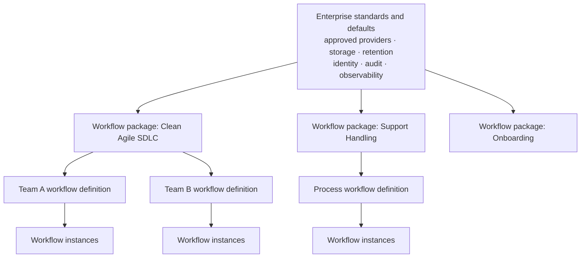

# CleanSquad — Vision and North Star Architecture

> **CleanSquad is a durable, declarative graph-based work orchestration runtime. It executes version-controlled workflows over persistent workflow instances, routing work to humans, AI agents, deterministic rules, services and external systems while preserving context, evidence and provenance.**

This document is the North Star for CleanSquad's product and architectural direction. It is a living architectural vision, not an implementation specification. It defines the enduring outcomes, conceptual model, boundaries and design invariants that future architecture and delivery work must preserve.

Read this document before treating the current implementation as the final boundary of the product.

---

## Contents

1. [What CleanSquad is becoming](#1-what-cleansquad-is-becoming)
2. [SDLC-first, domain-general](#2-sdlc-first-domain-general)
3. [Conceptual model](#3-conceptual-model)
4. [The object moving through the graph](#4-the-object-moving-through-the-graph)
5. [Execution context](#5-execution-context)
6. [Executors and providers](#6-executors-and-providers)
7. [System-of-record position](#7-system-of-record-position)
8. [Enterprise operating model](#8-enterprise-operating-model)
9. [Pluggability principles](#9-pluggability-principles)
10. [Synchronous and asynchronous execution](#10-synchronous-and-asynchronous-execution)
11. [Current state, near-term direction and North Star](#11-current-state-near-term-direction-and-north-star)
12. [Conceptual diagrams](#12-conceptual-diagrams)
13. [Glossary](#13-glossary)
14. [Delivery work](#14-delivery-work)

---

## 1. What CleanSquad is becoming

CleanSquad is not an SDLC automation script. It is not a multi-agent chaining library. It is not a Copilot wrapper.

CleanSquad is a **work orchestration runtime** in which:

- a **workflow definition** describes how work flows through a directed graph of nodes;
- a **workflow instance** represents a particular piece of demand moving through one execution of that graph;
- **context and evidence** travel with the instance as it progresses;
- **humans, AI agents, deterministic rules, services and external systems** can perform work at any node;
- **AI agents** run through replaceable execution providers;
- **intent** can originate from replaceable source systems;
- **storage, retention and integrations** can conform to enterprise standards;
- **execution history** becomes the authoritative record of how work was performed.

This is the North Star. The current implementation is a correct and valued first step toward it.

---

## 2. SDLC-first, domain-general

The initial product, default workflow and strongest examples focus on modern software delivery:

- The default workflow package implements a Clean Agile software delivery cycle.
- The canonical executor is a Copilot-backed AI agent.
- The canonical intent source is a Markdown request document.

These are **the first use case**, not the permanent boundary.

The core runtime must not unnecessarily encode SDLC-only concepts. The same graph/work/executor/context model should later orchestrate other repeatable processes, for example:

> A **support request** enters triage, is routed to investigation, an agent or engineer drafts a response, a team lead approves it, and the workflow closes with evidence of the resolution recorded.

This direction does not require CleanSquad to become a generic BPM suite immediately. The SDLC focus gives depth and real constraints; domain-generality gives durability.

A new contributor should therefore resist concluding that:

- Copilot is the CleanSquad domain model rather than the default agent provider;
- a Markdown file is the request abstraction rather than one intent provider;
- local files are the permanent persistence architecture;
- every node must be an AI agent;
- CleanSquad is only an SDLC automation script;
- the default Clean Agile workflow is the engine rather than one workflow package running on the engine.

---

## 3. Conceptual model

### Intent Provider

Where the request originated.

```
File | Inline text | GitHub Issue | Jira | API | Event
```

The provider resolves external demand into canonical Intent. Different sources may trigger the same workflow. Changing the provider must not change the workflow definition or the workflow instance model.

### Intent

The source-independent statement of what the workflow has been asked to achieve. Intent carries a durable snapshot and useful external references. It is immutable once captured: the workflow instance holds a point-in-time record of what was asked.

### Workflow Definition / Workflow Package

The version-controlled description of how work should flow. JSON workflow definitions are a first-class authoring model. A workflow package may include reusable assets — instructions, policies, personas, rules, contracts — alongside the graph.

Different teams, products, business areas or process owners may use different workflow definitions while sharing enterprise standards. A workflow definition is an independently versioned, reviewable artefact.

### Workflow Instance

The particular piece of demand moving through one execution of a workflow. The workflow instance is the **durable identity** that connects:

```
Intent
Workflow definition and version
Current graph position
Shared execution context
Work attempts and activations
Decisions made and routes selected
Results and evidence
External references
Provenance
Final outcome
```

> *Prefer the term **workflow instance** for the durable object being tracked through the graph. Use **work item** only when referring to specific task assignments; it can otherwise be confused with a Jira issue, a node activation, or a human assignment.*

### Execution Context

The durable, source-neutral information known about the workflow instance as it progresses. Execution context is conceptually distinct from:

- graph and control-flow state;
- the immutable, snapshotted Intent;
- large artefacts or external records;
- logs and telemetry;
- execution provenance.

Nodes declare what context they **consume** and what results they **produce**. Context must not mean blindly placing every previous artefact into every agent prompt. Explicit input/output declarations make execution predictable and auditable.

### Work / Node Activation

A concrete piece of work produced when the graph reaches an executable node. A Stage or Decision describes the business contract and its transitions. An activation represents that contract being performed for a particular workflow instance.

### Executor

Who or what performs the work at a node.

```
Human | Agent | Rule | Service | External system
```

The workflow contract — inputs, outputs, transitions — must remain stable when the executor changes. Swapping a human for an agent, or an agent for a rule engine, must not require changes to the workflow definition.

### Agent Execution Provider

How an AI agent is run.

```
Copilot SDK | another vendor SDK | internal runtime | remote worker
```

Copilot is the paved-road default, following the Mississippi abstraction model: it works out of the box and is the recommended path, but it is not the only path. The agent execution provider must not appear in the workflow contract. Changing the provider must not require rewriting workflow definitions.

### Result, Evidence and Provenance

- **Result** — the business output of the work performed at a node.
- **Evidence** — the material supporting or produced by that result; artefacts, documents, generated content.
- **Provenance** — who or what performed the work, through which provider where relevant, against which inputs, and what happened; includes retries, failures, waits and human interventions.

Together these form the authoritative record of how the workflow was executed.

---

## 4. The object moving through the graph

The workflow instance is the stable object. It does not change identity as it moves through the graph; nodes act upon it and add to it.



The workflow instance carries its Intent, context, external references and history. Nodes read declared inputs from the context and write declared outputs back to it. Nothing is passed implicitly.

---

## 5. Execution context

Execution context is not a bag of all previous outputs. It is a **structured, governed store** of named, typed facts about the workflow instance. Key properties:

- Each node declares what context keys it reads (inputs) and what it writes (outputs).
- The runtime resolves declared inputs at activation time.
- Outputs that are not declared are not placed into context.
- Large artefacts are stored externally; context holds references, not content.
- Context is separate from provenance, logs and graph state.

This discipline keeps agent prompts focused, makes execution predictable, and keeps the execution record human-readable.

---

## 6. Executors and providers

### Humans can participate

Human stages and human decision nodes are first-class citizens. A node may be assigned to a human work queue; the workflow instance waits until a human completes the work. This is not a workaround. It is the same node activation model used for every other executor.

### Agents are not required everywhere

Not every node must use an AI agent. Deterministic rules, calculations and service calls are valid executors. The workflow definition does not need to know which executor type will be used at design time if the contract is stable.

### Copilot is the paved-road default

Copilot remains the recommended agent execution provider. New setups work out of the box with Copilot. Teams that need a different provider can configure one without forking the workflow definition.

### Executor change does not break the graph

Changing who or what performs a node — from an agent to a human, from Copilot to another SDK — must not require changes to the workflow definition or to the workflow instance model.

---

## 7. System-of-record position

CleanSquad's intended authority is the **system of record for workflow execution**.

CleanSquad must be able to answer:

- Why does this workflow instance exist?
- Which workflow definition and version governed it?
- Where is it currently in the graph?
- What work is pending?
- Who or what performed each completed piece of work?
- What decisions were made and which routes were selected?
- What context, results and evidence were produced?
- Which external records does this execution relate to?
- What failed, retried, waited, looped or required human intervention?
- What was the final outcome?

A Jira issue, GitHub Issue, support record or another external object **may remain authoritative in its own system**. CleanSquad holds the references, snapshots, context and evidence required to orchestrate and explain execution. It does not aspire to replace purpose-built planning or business systems.

---

## 8. Enterprise operating model

An enterprise deploying CleanSquad should be able to establish standards once and then allow teams to define their own workflows within those standards.



The enterprise layer should cover:

- approved providers and integrations;
- storage, retention and security expectations;
- identity, permissions and human-work policies;
- shared rules, instructions and quality controls;
- observability and audit requirements;
- system-of-record mappings.

Workflow definitions remain independently versioned and reviewable. Different teams may use different graphs. Local variation should be possible within enterprise policy. The exact inheritance, composition and override mechanism is an architecture decision for later work.

---

## 9. Pluggability principles

These are the stable extension boundaries. They are stated as principles, not as final interface names.

| Boundary | What it isolates |
|---|---|
| Intent source | Where demand originates; does not affect the workflow contract |
| Executor | Who or what performs work; does not affect graph semantics |
| Agent execution provider | How an AI agent is run; does not appear in the workflow contract |
| Work delivery (in-process / out-of-process) | How activations are dispatched and results returned |
| Durable state and artefact storage | Where persistence lives; local files are the default |
| External system integrations and projections | Outbound references and inbound event reactions |
| Identity and authorisation | How humans are identified and how permissions are resolved |
| Observability and export | How execution events are recorded and surfaced |

The common path — local files, Copilot, Markdown request, Clean Agile workflow — must remain simple. Pluggability must not turn a local Copilot-backed workflow into an enterprise integration project.

---

## 10. Synchronous and asynchronous execution

Some work is completed synchronously: the runtime invokes the executor and waits for a result within the same run.

Some work is asynchronous or out-of-process:

- A human is assigned work and the workflow instance persists while it waits.
- A remote agent is dispatched and the result arrives later.
- An external system is polled or receives a callback.

The workflow definition must be able to express both patterns without encoding the transport mechanism. The workflow instance persists through the wait. Provenance records when the wait started, when it resolved, and what was received.

No specific broker, event stream or transport is mandated by this document.

---

## 11. Current state, near-term direction and North Star

### Today

- JSON graph with named nodes, each carrying a role, prompt, and declared inputs and outputs.
- Copilot SDK agent execution.
- Markdown request document as the intent source.
- Local durable artefacts persisted between runs.
- Clean Agile SDLC workflow as the canonical workflow package.
- Single-machine, synchronous execution.

### Next

- Provider-neutral agent execution (replaceable provider behind a stable contract).
- Human Stage and human Decision participation.
- Canonical Intent model decoupled from the file-based source.
- First-class workflow instance with structured execution context.
- Explicit node input/output declarations honoured at runtime.
- Pluggable persistence decoupled from the local file system.
- Executor- and provider-neutral provenance recording.
- GitHub Issue as an intent provider.

### North Star

- Enterprise-configurable, domain-general work orchestration.
- Authoritative execution history across humans, agents, rules, services and external systems.
- Multiple workflow packages, each independently versioned and deployable.
- Enterprise standards layer governing providers, storage, identity and audit.
- Asynchronous and out-of-process execution with durable wait.
- Non-SDLC workflow packages running on the same runtime.

---

## 12. Conceptual diagrams

### End-to-end conceptual flow



### The workflow instance moving through the graph

A single workflow instance carries stable identity while different nodes are performed by different executor types.



### Enterprise layering



---

## 13. Glossary

| Term | Definition |
|---|---|
| **Intent** | The source-independent, immutable statement of what the workflow has been asked to achieve, including a durable snapshot and external references. |
| **Intent Provider** | The component that resolves external demand (file, issue, API, event) into canonical Intent. |
| **Workflow Definition** | The version-controlled JSON description of how work flows through a directed graph. |
| **Workflow Package** | A workflow definition together with reusable assets: instructions, policies, personas, rules and contracts. |
| **Workflow Instance** | The durable identity representing one particular piece of demand moving through one execution of a workflow definition. |
| **Execution Context** | The structured, governed set of named facts known about a workflow instance as it progresses; distinct from graph state, artefacts, provenance and logs. |
| **Node Activation** | A concrete piece of work created when the graph reaches an executable node for a particular workflow instance. |
| **Stage** | A node type representing a unit of work with a defined business contract and transitions. |
| **Decision** | A node type that selects a route through the graph based on available context or human input. |
| **Executor** | Who or what performs work at a node: human, AI agent, deterministic rule, service or external system. |
| **Agent Execution Provider** | The component responsible for running an AI agent: Copilot SDK, another vendor SDK, internal runtime or remote worker. |
| **Result** | The business output of the work performed at a node. |
| **Evidence** | Material supporting or produced by a result: artefacts, documents, generated content. |
| **Provenance** | The record of who or what performed work, through which provider, against which inputs, and what happened, including failures and retries. |
| **Workflow Package** | A versioned collection containing a workflow definition and its supporting assets. |
| **Enterprise standards layer** | The organisation-wide defaults for approved providers, storage, retention, identity, audit and observability that govern all workflow packages and instances. |

---

## 14. Delivery work

The following issues represent the programme of work that advances the current implementation toward this North Star.

| Issue | Scope |
|---|---|
| [#8 — Executor/provider/source-neutral programme](https://github.com/Gibbs-Morris/clean-squad/issues/8) | Overarching programme tracking all neutrality work |
| [#9 — Replaceable agent execution providers](https://github.com/Gibbs-Morris/clean-squad/issues/9) | Provider abstraction and Copilot as default |
| [#10 — Multiple providers in one workflow](https://github.com/Gibbs-Morris/clean-squad/issues/10) | Mixed-provider workflow execution |
| [#11 — Asynchronous out-of-process agent execution](https://github.com/Gibbs-Morris/clean-squad/issues/11) | Remote/async agent dispatch and result collection |
| [#12 — Human Stage execution](https://github.com/Gibbs-Morris/clean-squad/issues/12) | Human participation at Stage nodes |
| [#13 — Human Decision resolution](https://github.com/Gibbs-Morris/clean-squad/issues/13) | Human participation at Decision nodes |
| [#14 — Outstanding human-work experience](https://github.com/Gibbs-Morris/clean-squad/issues/14) | UX and tooling for pending human work |
| [#15 — Canonical Intent](https://github.com/Gibbs-Morris/clean-squad/issues/15) | Source-neutral Intent model |
| [#16 — GitHub Issue Intent Provider](https://github.com/Gibbs-Morris/clean-squad/issues/16) | GitHub Issue as an intent source |
| [#17 — Executor- and provider-neutral provenance](https://github.com/Gibbs-Morris/clean-squad/issues/17) | Unified provenance recording across all executor types |
| [#19 — Workflow instance and shared execution context](https://github.com/Gibbs-Morris/clean-squad/issues/19) | First-class workflow instance and source-neutral context/results model |
| [#20 — Decouple durable workflow persistence from the local file system](https://github.com/Gibbs-Morris/clean-squad/issues/20) | Pluggable persistence with local files as the paved-road default |

---

*Examples and JSON snippets in this document are illustrative and do not mandate implementation structure, interface names or package layout. Refer to the delivery issues above for implementation decisions.*
