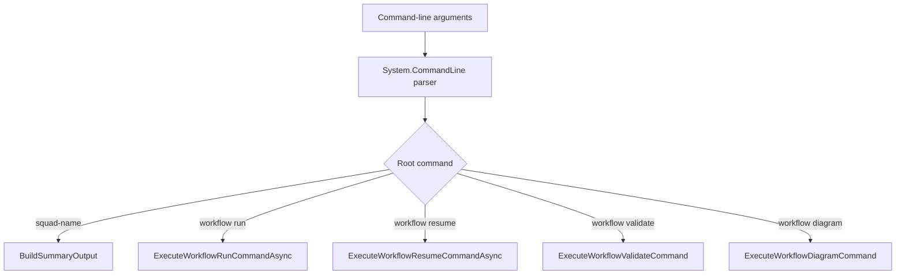

# Understanding the CLI Design

This document explains the design decisions behind the CleanSquad CLI and the reasoning that shaped them.
It is intended for contributors and anyone who wants to understand *why* the CLI behaves the way it does.

---

## Design goals

The CLI has three explicit design goals:

1. **Thin composition layer** — the CLI should do as little work as possible beyond parsing arguments, loading configuration, and delegating to the workflow engine. Business logic belongs in `CleanSquad.Core` and `CleanSquad.Workflow`.
2. **Stable entry point** — the public surface (`CliApplication.InvokeAsync`) should remain stable so tests and embedding scenarios do not need to change when internal structure evolves.
3. **Testable without a process boundary** — the CLI should be invocable from unit tests by injecting a fake orchestrator, a custom working directory, and a `TextWriter`, without spawning a real process.

---

## Workflow command dispatch

The CLI uses `System.CommandLine` to parse arguments and route invocations to internal handler methods.

Each handler is a focused private method.
The handler validates its inputs, resolves paths against the working directory, then delegates to the workflow engine or validator.

---

## Why branding is file-based

The CLI supports optional branding via a `clean-squad.cli.json` file in the working directory.
This allows teams to run CleanSquad under a different application name and command descriptions without recompiling or forking the CLI.

The branding file is loaded by `CliBrandingOptionsLoader` at startup.
If no file is present, sensible defaults are used.
The loader, not the options POCO, owns the file-loading responsibility.

---

## How the working directory is used

Every path argument the user supplies is resolved relative to the **working directory** at the time of invocation.
The working directory is either:

- the directory from which the CLI is executed (`Directory.GetCurrentDirectory()`), or
- the value passed via the `currentDirectory` parameter (used in tests)

This means users can supply relative paths in all commands and the CLI will resolve them correctly.

---

## Why workspace root is separate from working directory

The **working directory** is where the CLI looks for configuration files and resolves user-supplied paths.
The **workspace root** is the root of the repository the workflow is running against.

These can differ —  for example, when the CLI is invoked from a CI script in a tools directory that is not the repository root.
If `--workspace-root` is not supplied, the engine automatically locates the workspace root by walking up the directory tree from the working directory looking for a `.git` folder or similar workspace marker.

---

## Exit codes

The CLI follows standard POSIX exit code conventions:

| Code | Meaning |
| --- | --- |
| `0` | Success |
| `1` | User error (invalid arguments, missing files, validation failure) or workflow failure |
| `0` | Success |
| `1` | User error (invalid arguments, missing files, validation failure) or workflow failure |

Internal errors thrown from the workflow engine are caught, logged, and returned as exit code `1` with a human-readable message.

---

## Logging

The CLI uses structured logging via `Microsoft.Extensions.Logging`.
In normal use, log messages are written to the console using the simple console formatter with a timestamp prefix.

When the CLI is used in tests or embedded, logging can be disabled by passing a `loggerFactory` explicitly (or suppressed by setting `LogLevel.None`).
This prevents test output from being polluted with diagnostic messages.

All logging uses source-generated `[LoggerMessage]` methods for CA1848 compliance and zero-allocation hot paths.
