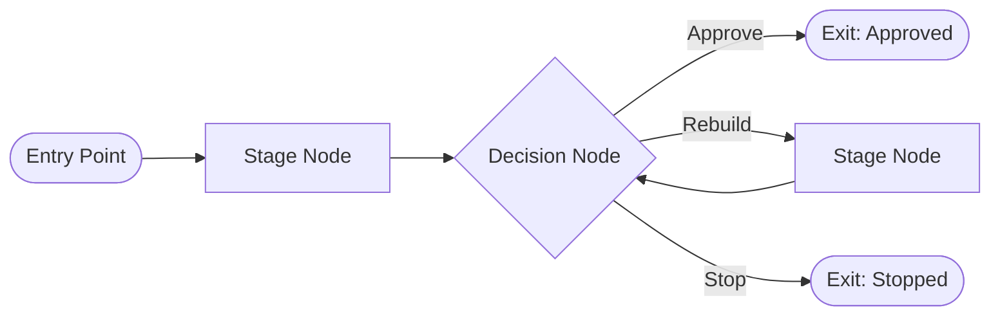
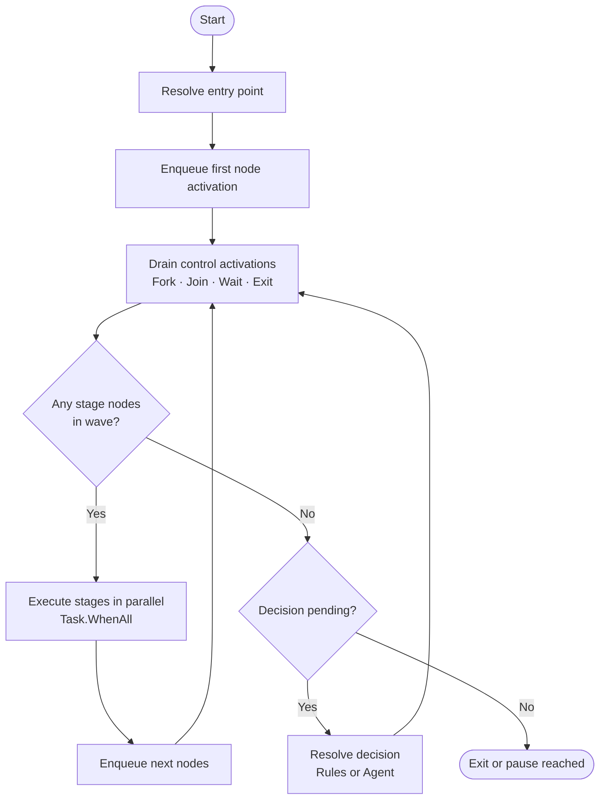
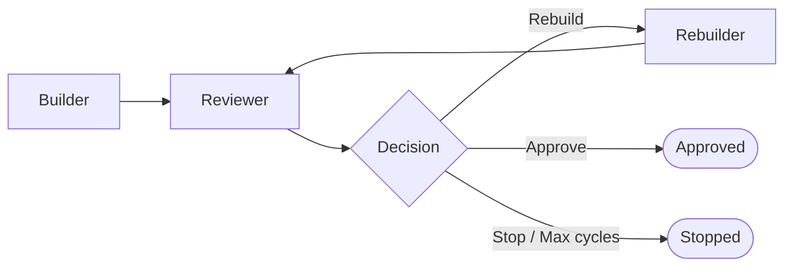
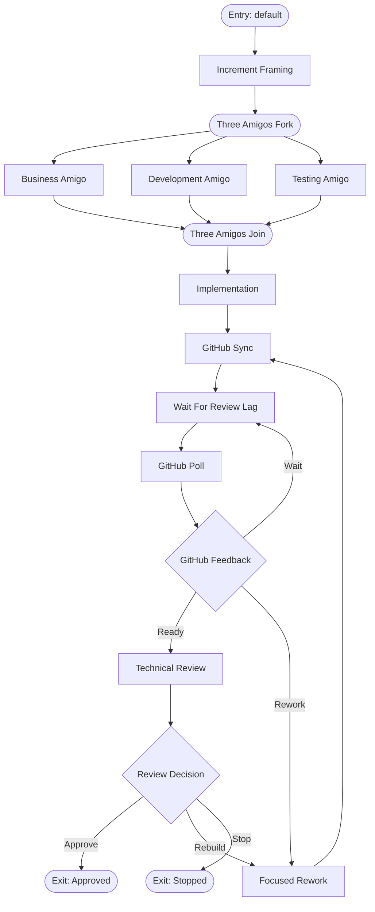

# Understanding the Workflow Model

The CleanSquad workflow engine executes structured, graph-based automation workflows defined in JSON.
This document explains what the model is, how it works, and why it is designed the way it is.

---

## What a workflow is

A workflow is a directed graph of **nodes** connected by transitions.
Each node represents a unit of work — a stage, a branching point, a join, a decision, or an exit.
The engine walks that graph from an entry point, executing nodes in order, until it reaches an exit node.

---

## Node kinds

| Kind | Purpose |
| --- | --- |
| `Stage` | Runs an agent to produce outputs. The primary unit of work. |
| `Fork` | Splits execution into parallel branches that all run concurrently. |
| `Join` | Waits for all branches from a matching `Fork` to complete before continuing. |
| `Wait` | Intentionally pauses the workflow for a configured duration so it can be resumed later. |
| `Decision` | Evaluates agent output and routes the graph to one of several named choices. |
| `Exit` | Terminates the workflow with a named status (`Approved`, `Stopped`). |

---

## How agents and nodes relate

A `Stage` node is **not** an agent.
A stage node describes *what to produce* (inputs, outputs, custom message) and *which assets to load* (persona, rules).
The agent runner receives that assembled context and executes it.

This separation means the same agent runtime can serve different stages with different roles simply by loading different assets — without the engine needing to know anything about the agent implementation.

---

## How the engine runs a workflow

The engine follows these steps for every run:

1. The engine resolves the entry point and enqueues the first activation.
2. It drains **control activations** synchronously: Fork nodes fan out, Join nodes gate until all branches complete, Wait nodes intentionally pause the run, and Exit nodes terminate it.
3. It collects the current **stage wave** — all `Stage` nodes that are ready to run at the same time — and runs them in parallel.
4. After a wave completes, it enqueues the successor nodes and loops.
5. When a `Decision` node is encountered, the engine resolves the route using either agent output rules or a dedicated decision agent, then continues from the chosen branch.

---

## Persistent state and resumption

Every workflow run writes its progress to a **run folder** on disk. The run folder contains:

- `state.json` — the full serialized run state, including which nodes have executed, which are pending, and all decision history
- `event.ndjson` — a structured event log of every step and transition
- agent output files for each completed stage

If a run is interrupted — by an error, a timeout, a deliberate stop, or an intentional wait pause — it can be **resumed** from its last known state.
The engine reads `state.json`, re-enqueues any pending activations, and continues from where it left off.
Stages that already completed are not re-executed.

When a workflow pauses at a `Wait` node, the run status becomes `Paused` instead of `Failed`.
The run folder records the active waiting node, the reason, and the earliest resume time.
If you resume too early, the workflow remains paused and preserves the same waiting state.

---

## Entry points

A workflow definition can declare multiple **entry points**.
Each entry point names a node id to start from.
This allows a single workflow definition to be run from different starting positions:

- `default` — the standard start for a full run
- `build` — skip planning and jump directly to the implementation stage
- `review` — start from the review stage when the implementation is already done

The default entry point is used when no `--entry-point` flag is supplied.

---

## Policy and cycles

The workflow policy governs how many times the review-rebuild loop is allowed to execute before the engine stops automatically.
This prevents infinite rework cycles.

The policy specifies:

- `maxReviewCycles` — the maximum number of times the reviewer can be called before the engine stops
- `maxRebuilds` — the maximum number of times the rebuilder can be called
- `decisionMode` — `Rules` (automatic rule-based routing) or `Agent` (delegate to a dedicated decision agent)

---

## Workflow definition packages

A workflow definition package is a folder containing:

- `workflow.json` — the graph definition
- `agents/` — per-agent persona files
- `instructions/general/` — shared reasoning guidance
- `instructions/repository/` — repository-specific guidance
- `rules/workflow/` — workflow-wide RFC 2119 rules
- `rules/agents/` — per-agent RFC 2119 rules

The CLI loads a package by pointing to the `workflow.json` file.
All other assets are resolved relative to that file's directory.

---

## The default workflow

The default package (`workflow-definitions/default/`) models a **Clean Agile delivery loop**:

Each stage has a distinct role and a corresponding agent persona that shapes how the agent approaches its work.
The default workflow now includes a dedicated GitHub manager loop so pull request creation, delayed automated review feedback, and pending CI results can be handled explicitly before the review and rework loops continue.
