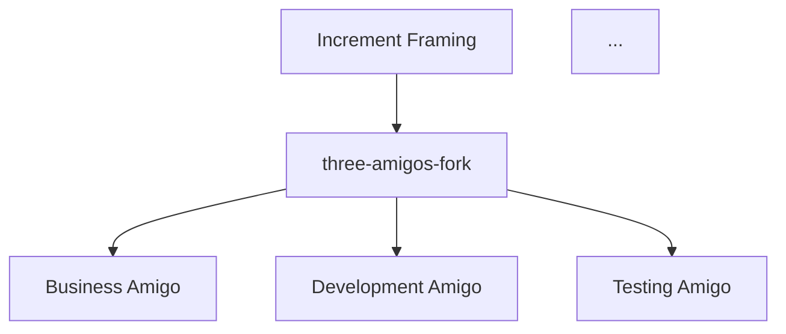
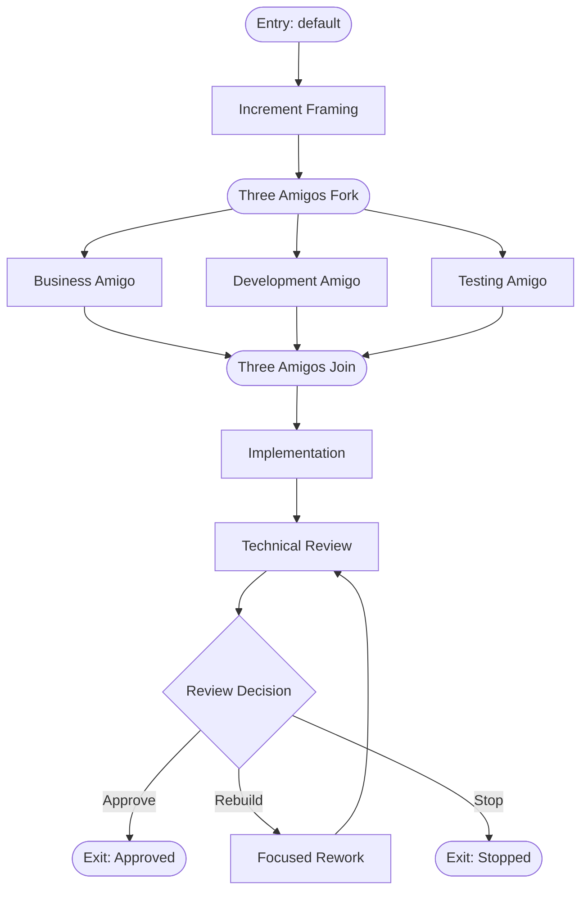

# How to generate a workflow diagram

Use this guide when you want to produce a Mermaid flowchart diagram from a workflow definition.
Diagrams are useful for reviewing the structure of a workflow and for including in documentation.

---

## Prerequisites

- The solution has been built: `dotnet build CleanSquad.slnx`
- You have a `workflow.json` file to diagram

---

## Steps

### 1. Generate the diagram

```shell
dotnet run --project src/CleanSquad.Cli -- workflow diagram \
  --definition <path-to-workflow.json>
```

For example, to diagram the default workflow:

```shell
dotnet run --project src/CleanSquad.Cli -- workflow diagram \
  --definition workflow-definitions/default/workflow.json
```

By default, the output file is written next to the `workflow.json` file.
For the default definition this produces `workflow-definitions/default/workflow.diagram.md`.

### 2. Specify a custom output path

Supply `--output` to write the diagram to a specific location:

```shell
dotnet run --project src/CleanSquad.Cli -- workflow diagram \
  --definition workflow-definitions/default/workflow.json \
  --output docs/diagrams/default-workflow.md
```

The output path is resolved relative to the working directory.

---

## What the output looks like

The output file is a Markdown file containing a fenced Mermaid `flowchart TD` code block:

````markdown

````

Any Markdown renderer that supports Mermaid (GitHub, VS Code with the Markdown Preview Mermaid Support extension)
will render the diagram as a visual flowchart.

---

## Viewing the rendered diagram

The rendered diagram for the default workflow looks like this:



---

## Related

- [Validate a workflow definition](validate-a-workflow-definition.md)
- [CLI command reference](../reference/commands.md)
- [Workflow model explanation](../explanation/workflow-model.md)
