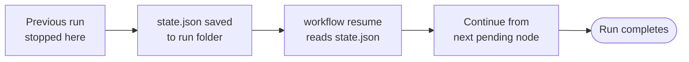

# How to resume an interrupted or paused workflow

Use this guide when a previous workflow run did not complete or intentionally paused and you want to continue from where it stopped.

---

## Prerequisites

- You have a run folder from a previous `workflow run` that contains a `state.json` file.
- The solution has been built: `dotnet build CleanSquad.slnx`

---

## When to resume

A run can be resumed after:

- The process was interrupted (cancelled, timed out, or killed)
- An agent produced an error and the run stopped mid-way
- The run was deliberately stopped (exit status `Stopped`)
- The workflow intentionally paused at a `Wait` node while waiting for delayed review feedback or CI results

The engine replays the saved state and continues from the last pending node or from any wait that is ready to continue.
Stages that already completed are not re-executed.



---

## Steps

### 1. Find the run folder

Run folders are stored under `workflow-runs/`.
Each folder is named with a timestamp and the request file name:

```shell
ls workflow-runs/
```

Identify the folder for the run you want to resume.

### 2. Resume the run

```shell
dotnet run --project src/CleanSquad.Cli -- workflow resume \
  workflow-runs/<run-folder-name>
```

Replace `<run-folder-name>` with the name of your run folder, for example:

```shell
dotnet run --project src/CleanSquad.Cli -- workflow resume \
  workflow-runs/20260410-223505-request
```

### 3. Optionally override the entry point

In rare cases you may want to resume from a different node than the one the engine would pick from state.
Supply `--entry-point` to override:

```shell
dotnet run --project src/CleanSquad.Cli -- workflow resume \
  workflow-runs/20260410-223505-request \
  --entry-point review
```

---

## What to expect

The CLI reads `state.json` from the run folder, re-enqueues any pending activations, and executes the remaining nodes.
If the run was paused at a wait node and the configured wait time has not elapsed yet, the run remains paused and records the same waiting state.
New stage outputs are appended to the existing run folder.
When the run finishes or pauses intentionally, the CLI exits with code `0`.

---

## Troubleshooting

- **"File not found" for the run path** — verify the folder name matches a folder that exists under `workflow-runs/`.
- **"state.json not found"** — the folder may have been created but the run never started; try a fresh `workflow run` instead.
- **Run exits immediately with status `Stopped`** — the previous run reached a deliberate stop exit. Check `state.json` to understand why and start a new run with an adjusted request if needed.
- **Run exits immediately with status `Paused`** — the wait window probably has not elapsed yet. Check the waiting details in `state.md` or `state.json`, wait until the recorded resume time, and run `workflow resume` again.

---

## Related

- [Run a workflow](run-a-workflow.md)
- [CLI command reference](../reference/commands.md)
- [Workflow model — persistent state and resumption](../explanation/workflow-model.md)
