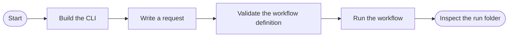
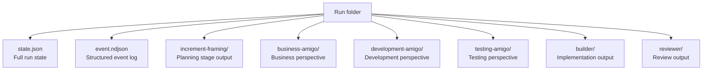

# Tutorial: Run your first workflow

In this tutorial you will validate an existing workflow definition and then run it against a real request.
By the end you will have a completed workflow run folder on disk and a clear picture of how the CLI fits together.

---

## Prerequisites

Before you begin, make sure you have the following in place:

- **.NET SDK 10.0.103 or later (patch roll-forward)**
  The repository's `global.json` pins `10.0.103` with `latestPatch` roll-forward. Install the SDK from [dot.net](https://dotnet.microsoft.com/download) if needed.

- **Repository cloned to your machine**

  ```shell
  git clone https://github.com/Gibbs-Morris/clean-squad.git
  cd clean-squad
  ```

- **Packages restored**

  ```shell
  dotnet restore CleanSquad.slnx
  ```

Once `dotnet restore` completes without errors you are ready to follow the steps below.

---

## What you will do



---

## Step 1 — Build the project

Open a terminal at the repository root and build the solution:

```shell
dotnet build CleanSquad.slnx
```

You should see output ending with:

```text
Build succeeded.
```

If the build fails, check that your .NET SDK version matches the version in `global.json`.

---

## Step 2 — Write a request document

The `workflow run` command requires a Markdown request document.
Create a file called `my-request.md` in the repository root:

```markdown
# Add a greeting to the CLI output

When the user runs `cleansquad` without arguments the output currently says nothing useful.

## Goal

Print a friendly welcome message that includes the squad name and the application version.

## Acceptance criteria

- Running `cleansquad` prints at least one line containing the squad name.
- Running `cleansquad Delta` prints a line containing `Delta`.
- No existing tests break.
```

Save the file and return to the terminal.

---

## Step 3 — Validate the workflow definition

Before starting a run, confirm the workflow definition is valid:

```shell
dotnet run --project src/CleanSquad.Cli -- workflow validate \
  --definition workflow-definitions/default/workflow.json
```

You should see output similar to:

```text
Validation passed. 0 errors.
```

If you see errors, check that the `workflow-definitions/default/` folder is intact.

---

## Step 4 — Run the workflow

Start a workflow run using your request document:

```shell
dotnet run --project src/CleanSquad.Cli -- workflow run \
  --definition workflow-definitions/default/workflow.json \
  my-request.md
```

The CLI will:

1. Validate the definition and request paths.
2. Create a timestamped run folder inside `workflow-runs/` (for example, `workflow-runs/20260412-090000-my-request/`).
3. Execute the workflow nodes in order, writing outputs to the run folder as each stage completes.
4. Exit with code `0` when the workflow finishes.

Watch the terminal output. Each completed stage is logged before the next one starts.

---

## Step 5 — Inspect the run folder

The run folder contains every artifact the workflow produced:



Open `state.json` in any text editor to see the full run state, including the decision history and final exit status.

Open the individual stage folders to read the Markdown outputs each agent produced.

---

## What you have learned

- How to validate a workflow definition before running it.
- How to write a request document that gives the workflow clear goals and acceptance criteria.
- How the CLI creates a timestamped run folder and saves outputs for every stage.
- Where to find the run state and event log after a run completes.

---

## Next steps

- [How to resume an interrupted workflow](../how-to/resume-a-workflow.md)
- [How to generate a diagram of a workflow](../how-to/generate-a-workflow-diagram.md)
- [Workflow model explanation](../explanation/workflow-model.md)
- [CLI command reference](../reference/commands.md)
